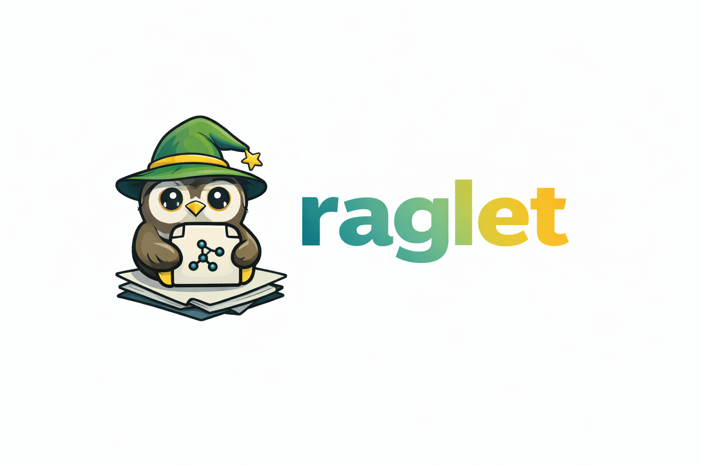

<div align="center">
  
</div>

# raglet

[](https://www.python.org/downloads/)
[](https://opensource.org/licenses/MIT)
[](https://github.com/psf/black)

**Portable memory for small text corpora.**

raglet creates searchable `.raglet` files from your documents. No infrastructure, no servers, no API keys. Just `pip install raglet`.

## The Problem

There's a class of knowledge that's **small but too big for a prompt**:
- A codebase
- A Slack conversation
- A WhatsApp chat export
- A folder of meeting notes

These are small (a few megabytes) but don't fit in a context window. They also don't justify a vector database, server, or infrastructure setup.

## The Solution

raglet is **portable memory**. It takes small context and turns it into a single `.raglet` file that you can save, share, commit, or carry around. Load it anywhere, search it instantly, and get retrieval-ready context for any LLM or tool.

**No server. No API keys. No infrastructure. Just a Python object and a file.**

## Quick Start

### CLI

```bash
# Build raglet from files/directories/globs (creates directory)
raglet build docs/ --out .raglet/
raglet build *.py                    # → raglet-out/
raglet build docs/ --out my-kb/

# Build with custom configuration
raglet build docs/ --out .raglet/ --chunk-size 1024 --chunk-overlap 100
raglet build docs/ --out .raglet/ --model all-mpnet-base-v2
raglet build docs/ --out .raglet/ --ignore ".git,__pycache__,.venv" --max-files 100

# Query raglet (works with any format)
raglet query "what is X?" --raglet .raglet/
raglet query "how does Y work?" --raglet knowledge.sqlite --top-k 10
raglet query "python" --raglet export.zip --top-k 5

# Add files incrementally (works with any format)
raglet add file.txt --raglet .raglet/
raglet add file.txt --raglet knowledge.sqlite

# Package (convert between formats)
raglet package --raglet .raglet/ --format zip --out export.zip
raglet package --raglet export.zip --format sqlite --out knowledge.sqlite
raglet package --raglet knowledge.sqlite --format dir --out .raglet/
```

### Python Library

```python
from raglet import RAGlet

# Create from files
rag = RAGlet.from_files(["doc.txt", "notes.md"])

# Search for relevant chunks
results = rag.search("what is X?", top_k=5)

# Get all chunks
chunks = rag.get_all_chunks()

# Save to directory (default format)
rag.save(".raglet/")

# Load later
rag = RAGlet.load(".raglet/")
```

### Docker CLI

**Use as a standalone tool:** Run raglet instantly against any workspace:

```bash
# Build knowledge base from workspace (creates directory)
# -v mounts your local project directory into the container at /workspace
docker run -v /path/to/project:/workspace mkarots/raglet \
  build docs/ --out .raglet/

# Query knowledge base (works with any format)
docker run -v /path/to/project:/workspace mkarots/raglet \
  query --raglet .raglet/ --q "what is Python?" --top-k 10

docker run -v /path/to/project:/workspace mkarots/raglet \
  query --raglet knowledge.sqlite --q "what is Python?" --top-k 10

docker run -v /path/to/project:/workspace mkarots/raglet \
  query --raglet export.zip --q "what is Python?" --top-k 10

# Add files incrementally (works with any format)
docker run -v /path/to/project:/workspace mkarots/raglet \
  add --raglet .raglet/ new_file.txt

docker run -v /path/to/project:/workspace mkarots/raglet \
  add --raglet knowledge.sqlite new_file.txt

# Package (convert between formats)
docker run -v /path/to/project:/workspace mkarots/raglet \
  package --raglet .raglet/ --format zip --out export.zip

docker run -v /path/to/project:/workspace mkarots/raglet \
  package --raglet export.zip --format sqlite --out knowledge.sqlite

docker run -v /path/to/project:/workspace mkarots/raglet \
  package --raglet knowledge.sqlite --format dir --out .raglet/
```

**Knowledge base lives in `.raglet/` directory** - mount your workspace and it just works!

## The `.raglet/` Directory Structure

When you save a raglet to a directory (e.g., `rag.save(".raglet/")`), it creates an open, inspectable format:

```
.raglet/
├── config.json      # Configuration (chunking, embedding model, search settings)
├── chunks.json      # Array of chunks (text, source, index, metadata)
├── embeddings.npy   # NumPy array of embeddings (float32)
└── metadata.json    # Version, timestamps, chunk count, embedding dimensions
```

**All files are human-readable JSON** (except embeddings.npy which is NumPy format). You can:
- Inspect chunks: `cat .raglet/chunks.json`
- Check config: `cat .raglet/config.json`
- Extract embeddings: `python -c "import numpy as np; print(np.load('.raglet/embeddings.npy'))"`
- Git commit the entire directory
- Share it as-is or package to zip

This open format ensures **no lock-in** - your data is always accessible.

## Installation

### Python Package

```bash
pip install raglet
```

### Docker Image

```bash
# Pull from Docker Hub
docker pull mkarots/raglet

# Or build locally
docker build -t mkarots/raglet .
```

### Development

For development (requires [uv](https://github.com/astral-sh/uv)):

```bash
# Install uv if you haven't already
curl -LsSf https://astral.sh/uv/install.sh | sh

# Install dependencies
make install-dev
```

## Features

**Current:**
- ✅ Extract text from .txt and .md files
- ✅ Intelligent chunking with sentence awareness
- ✅ Local embeddings (sentence-transformers)
- ✅ Vector search (FAISS)
- ✅ Semantic search API
- ✅ Portable directory format (`.raglet/`)
- ✅ Save/load operations
- ✅ Incremental updates
- ✅ CLI interface
- ✅ Docker image
- ✅ SOLID architecture with clear interfaces

**Coming Soon:**
- 🔜 Additional text file format optimizations

## Principles

1. **Portable** - One `.raglet/` directory. Save it, git commit it, email it (or export to zip)
2. **Small by design** - Workspace-scale (codebases, conversations, notes). Not the internet
3. **Retrieval only** - raglet finds chunks. You decide what to do with them. Bring your own LLM
4. **Open format** - The `.raglet/` directory is easily inspectable (JSON files). Embeddings are extractable. No lock-in
5. **Zero infrastructure** - `pip install raglet` or `docker run mkarots/raglet`. That's it

## Development

```bash
make install-dev     # Install with dev dependencies
make test            # Run all tests
make test-unit       # Unit tests only
make test-integration # Integration tests only
make test-e2e        # E2E tests only
make lint            # Run linters
make format          # Format code
make type-check      # Type checking
make ci              # Full CI pipeline
```

## Architecture

raglet follows SOLID principles with clear separation of concerns:

- **core/** - Domain models and orchestrator
- **processing/** - Document extraction and chunking
- **embeddings/** - Embedding generation
- **vector_store/** - Vector storage and search
- **storage/** - File serialization
- **config/** - Configuration system

See [docs/proposals/ARCHITECTURE.md](docs/proposals/ARCHITECTURE.md) for details.

## Status

**Milestone 3 Complete** - Portable File Format & CLI  
**Ready for Use** - Directory format, Docker image, CLI interface

See [plans/FINAL_PLAN.md](plans/FINAL_PLAN.md) for roadmap.

## API Reference

### Create from files

```python
from raglet import RAGlet

# From files, directories, or globs
rag = RAGlet.from_files(["docs/"])
rag = RAGlet.from_files(["file.txt", "file.md"])
rag = RAGlet.from_files(["*.py", "docs/**/*.md"])

# With ignore patterns
rag = RAGlet.from_files(["docs/"], ignore_patterns=[".git", "__pycache__"])

# With custom config
from raglet import RAGletConfig
config = RAGletConfig()
config.chunking.size = 1024
config.chunking.overlap = 100
config.embedding.model = "all-mpnet-base-v2"
rag = RAGlet.from_files(["docs/"], config=config)
```

### Build Command Configuration

The `build` command supports several configuration options:

```bash
# Chunking configuration
raglet build docs/ --chunk-size 1024 --chunk-overlap 100

# Embedding model selection
raglet build docs/ --model all-mpnet-base-v2
raglet build docs/ --model BAAI/bge-small-en-v1.5

# File filtering
raglet build docs/ --ignore ".git,__pycache__,.venv,node_modules"
raglet build docs/ --max-files 100  # Limit number of files processed

# Combined example
raglet build docs/ --out .raglet/ \
  --chunk-size 1024 \
  --chunk-overlap 100 \
  --model all-mpnet-base-v2 \
  --ignore ".git,__pycache__" \
  --max-files 500
```

**Available options:**
- `--chunk-size`: Size of text chunks (default: 512)
- `--chunk-overlap`: Overlap between chunks (default: 50)
- `--model`: Embedding model name (default: all-MiniLM-L6-v2)
- `--ignore`: Comma-separated patterns to ignore (default: .git,__pycache__,.venv,node_modules,.raglet)
- `--max-files`: Maximum number of files to process (default: all)

### Load existing raglet

```python
# Auto-detects format (.sqlite/.db → SQLite, .zip → Zip, dir → Directory)
rag = RAGlet.load(".raglet/")
rag = RAGlet.load("knowledge.sqlite")
rag = RAGlet.load("export.zip")
```

### Search

```python
# Basic search
results = rag.search("what is X?", top_k=5)

# With similarity threshold
results = rag.search("query", top_k=10, similarity_threshold=0.7)

# Access results
for chunk in results:
    print(f"Score: {chunk.score}")
    print(f"Text: {chunk.text}")
    print(f"Source: {chunk.source}")
```

### Add content

```python
# Add raw text (auto-chunks)
rag.add_text("Some text to add", source="manual")
rag.add_text("More text", source="chat", metadata={"session": "123"})

# Add single file
rag.add_file("new_file.txt")

# Add multiple files
rag.add_files(["file1.txt", "file2.md"])

# Add chunks directly (low-level)
from raglet.core.chunk import Chunk
chunks = [Chunk(text="...", source="...", index=0)]
rag.add_chunks(chunks)
```

### Save

```python
# Save to directory (default)
rag.save(".raglet/")

# Save to SQLite
rag.save("knowledge.sqlite")

# Save to zip (read-only, no incremental updates)
rag.save("export.zip")

# Incremental save (if backend supports it)
rag.save(".raglet/", incremental=True)

# Save immediately when adding
rag.add_text("text", source="chat", file_path=".raglet/")
rag.add_file("file.txt", save_path=".raglet/")
```

### Storage Formats

**Directory (`.raglet/`)**
- Format: Directory with JSON files
- Incremental: ✅ Supported
- Best for: Development, git-friendly

**SQLite (`.sqlite`, `.db`)**
- Format: Single SQLite database file
- Incremental: ✅ Supported
- Best for: Production, single-file portability

**Zip (`.zip`)**
- Format: Zip archive
- Incremental: ❌ Not supported (read-only)
- Best for: Export/import, sharing

## Common Patterns

### Agent loop with batched saves

```python
from pathlib import Path
from raglet import RAGlet

rag = RAGlet.load(".raglet/") if Path(".raglet/").exists() else RAGlet.from_files(["docs/"])
unsaved_chars = 0
SAVE_THRESHOLD = 1000

while True:
    query = input("You: ")
    if query == "exit":
        if unsaved_chars > 0:
            rag.save(".raglet/")
        break
    
    results = rag.search(query, top_k=5)
    response = your_llm(results, query)
    
    rag.add_text(query, source="chat")
    rag.add_text(response, source="chat")
    unsaved_chars += len(query) + len(response)
    
    if unsaved_chars >= SAVE_THRESHOLD:
        rag.save(".raglet/")
        unsaved_chars = 0
```

### Load or create

```python
from pathlib import Path
from raglet import RAGlet

raglet_path = ".raglet/"
rag = RAGlet.load(raglet_path) if Path(raglet_path).exists() else RAGlet.from_files(["docs/"])
```

### Search and use with LLM

```python
# Search for context
context_chunks = rag.search("user query", top_k=5)
context = "\n\n".join([c.text for c in context_chunks])

# Use with your LLM
response = llm.generate(context, "user query")

# Store conversation
rag.add_text("user query", source="chat")
rag.add_text(response, source="chat")
rag.save(".raglet/")
```

## Documentation

- [Problem Statement](docs/problems/00-problem-statement.md) - Why raglet exists
- [Architecture Decisions](docs/decisions/) - All architectural decisions
- [Implementation Plan](docs/plans/FINAL_PLAN.md) - Roadmap and milestones
- [Usage Patterns](docs/USAGE_PATTERNS.md) - Common usage patterns
- [Agent Instructions](CLAUDE.md) - For contributors

## License

MIT
